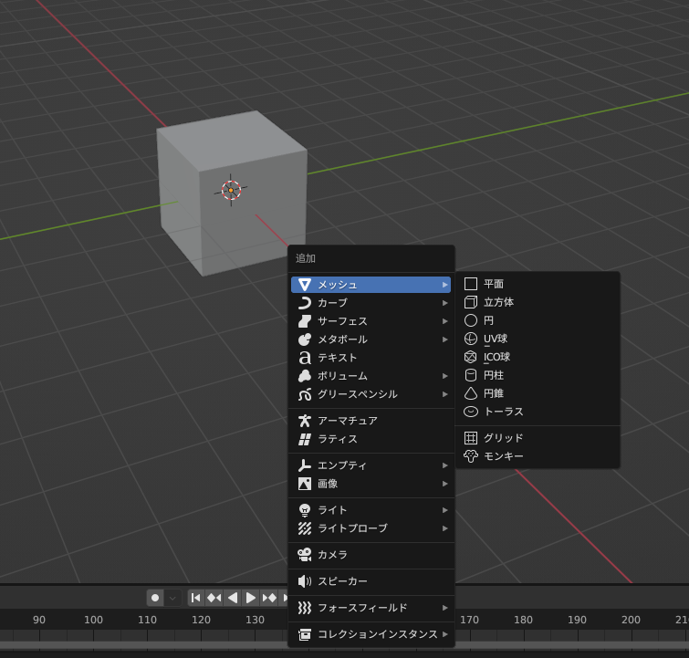

# Blender コマンド

- 分割のショートカットキー：alt/option + M
- 分割はオブジェクトの中で分かれる
- 分離のショートカットキー：P
- 分離は別のオブジェクトに分離（独立）する
- 切り裂き：V
- 複製：shift + D
- **shift + A**

　

- **面を埋める方法　フィル**

- **立方体の簡単変形（３角に）**

　　編集モードに切り替えて、辺のボタンを選択する。

キューブの辺を選択する。

右クリックで選択メニューを出し、辺を溶解を選ぶ。

するとこのように三角に簡単に変更できる。

- スナップ（オブジェクトを別のオブジェクトに接地させる）

〔編集モード〕

図のようにスナップのアイコンをオンにする（磁石のアイコンを青にする）

接地したいオブジェクトを選択し、Ｇを押下

→接地先オブジェクトの頂点のところにオレンジの〇カーソルを持っていくと完了

- オブジェクトの結合

〔オブジェクトモード〕

結合したいオブジェクトをすべて選択し、Ctrl＋J押下で結合される

- オブジェクトをくり抜く（ブーリアン）

〔オブジェクトモード〕

くりぬきたいオブジェクト(以下A)と、くりぬきたい形のオブジェクト(以下B)を用意する。

Aを選択しモディファイアプロパティからモディファイアを追加を選択

→生成から「ブーリアン」を選ぶ

オブジェクト欄のスポイトを選択し、くり抜きたい形を設定する。

Ｈを押下すると、以下のようにくり抜きのプレビューが表示される。

表示を戻したい場合はAlt＋Hで元の状態に戻る。

位置など問題なければ、モディファイア上でCtrl＋Aを押下またはボタンから選択し完了する。

