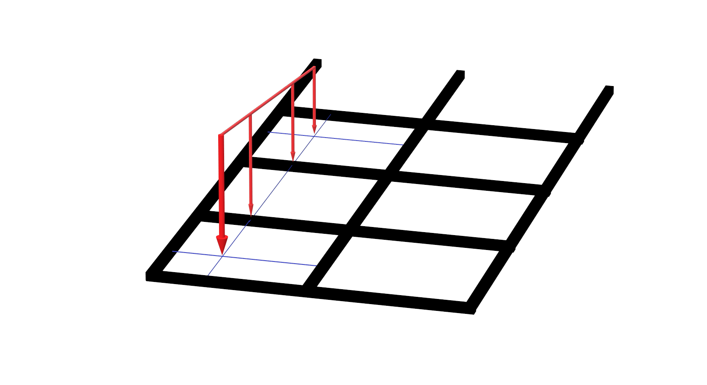
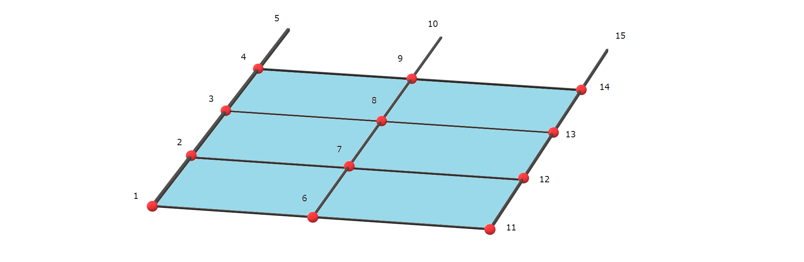
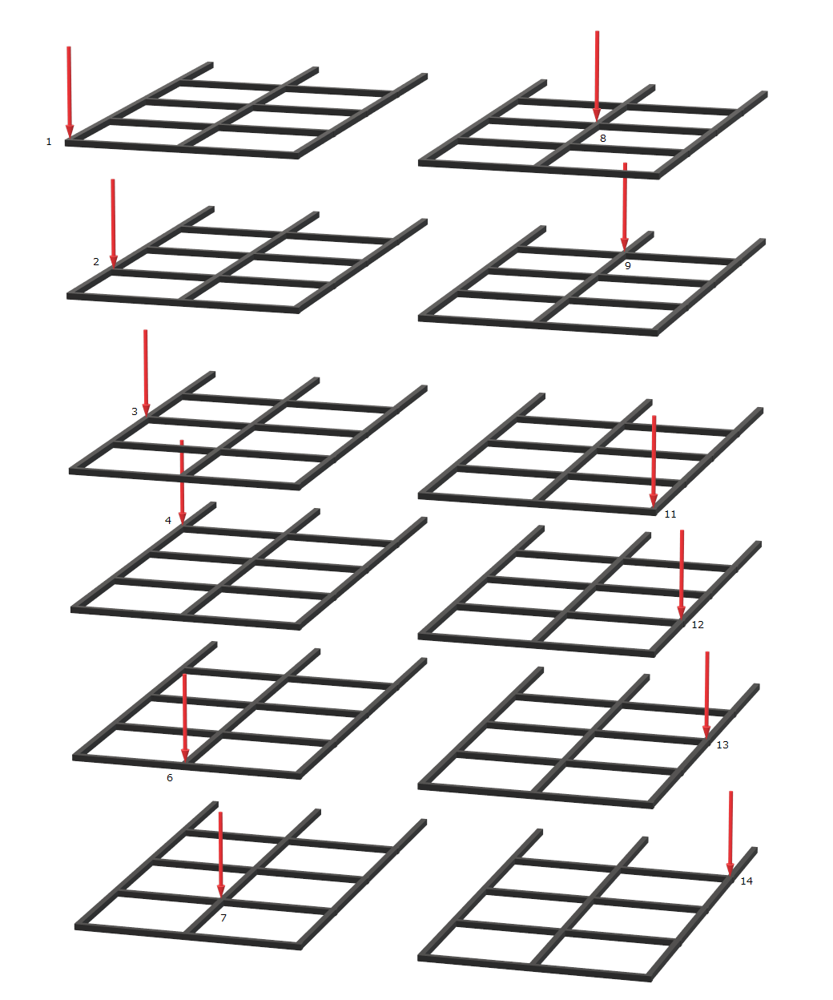
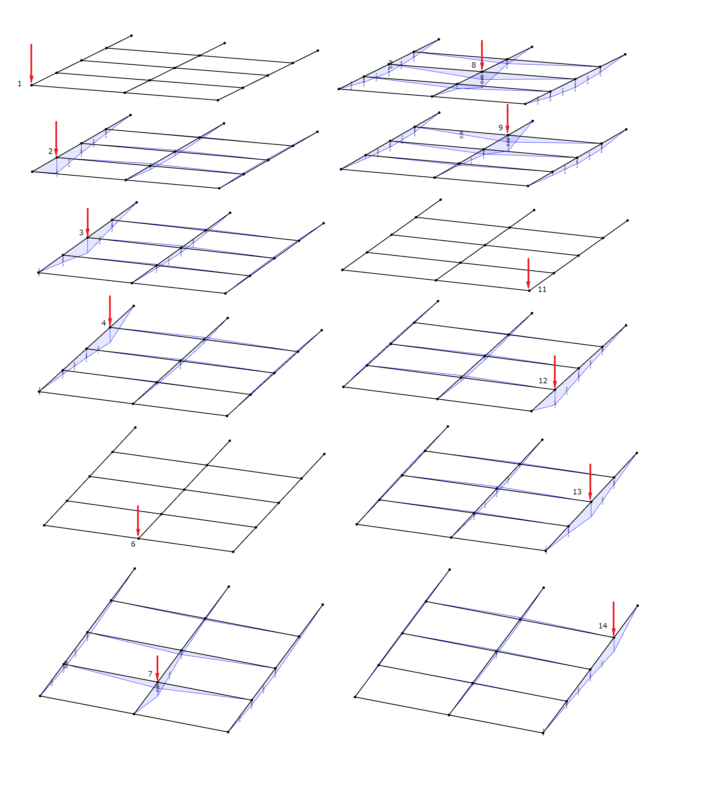
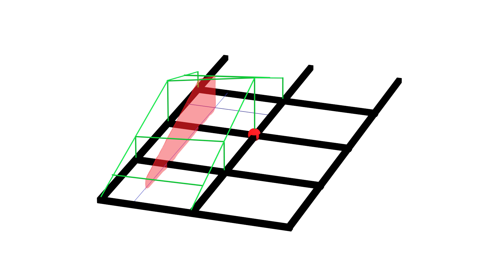

# 影響線載荷計算～面線荷重～

## 1. 影響線載荷計算とは

今回は、
## 面線荷重 について解説します。

## 2. 算出手順
### (1) 面を構成する節点を定義します。

### (2) 求めたい面分布荷重と同じ方向の節点荷重を面を構成する全ての点に載荷します。

1kN の節点荷重を全ての点に載荷します。

### (3) 載荷した荷重に対する解析結果を保存します

### (4) 面上の線荷重が載荷した場合を考える

#### 節点8の断面力（曲げモーメント）について考える

| 記号 |   | 節点8の断面力 |
| ---- | ---- | ---- |
| a1 | 1に載荷した場合 | 0.00 |
| a2 | 2に載荷した場合 | 0.35 |
| a6 | 6に載荷した場合 | 0.00 |
| a7 | 7に載荷した場合 | 0.30 |

節点8 の断面力は、赤の面積

