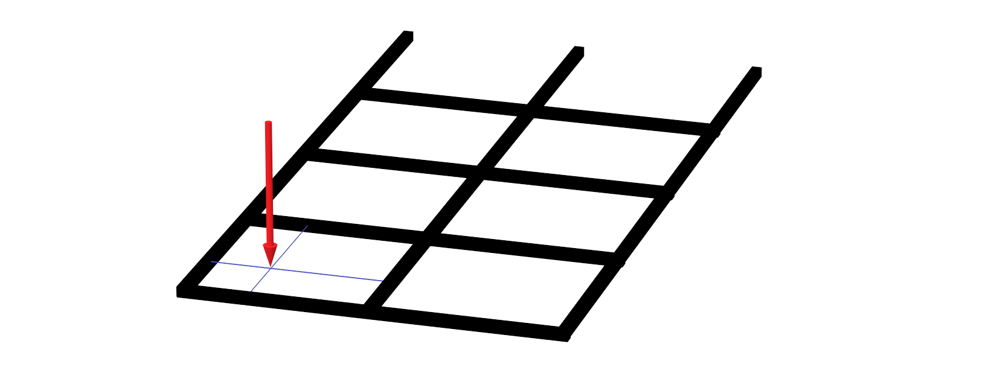
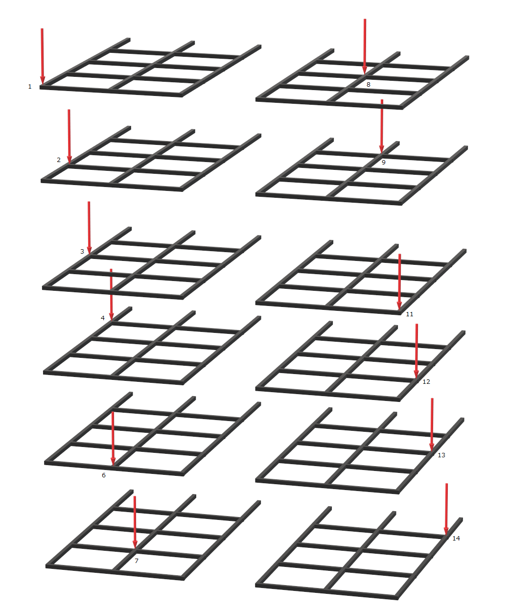
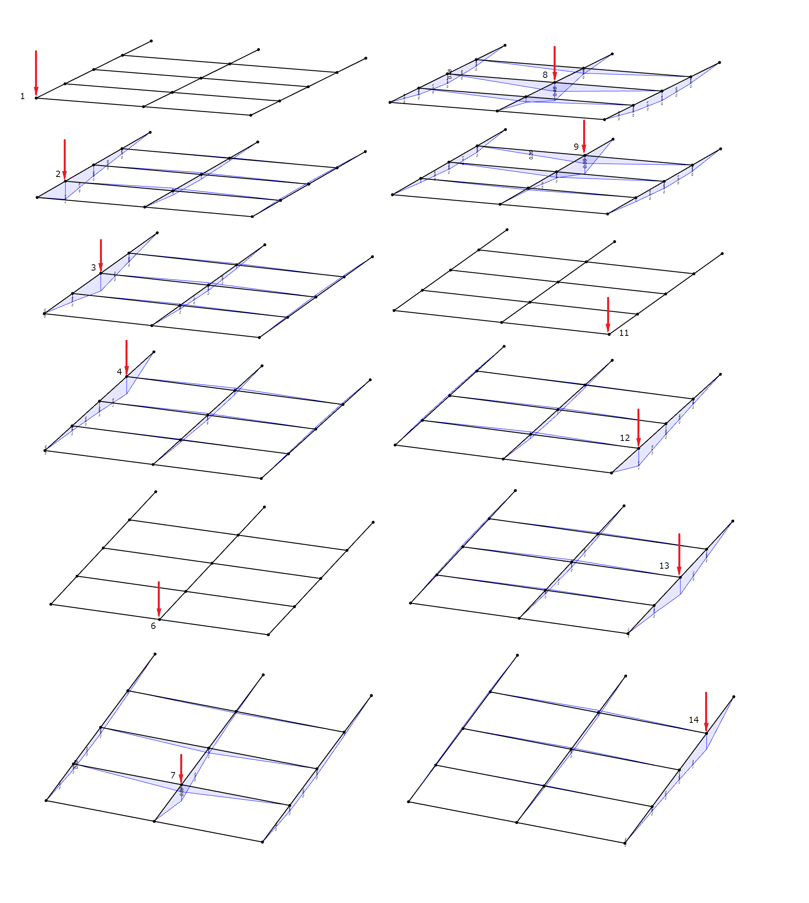
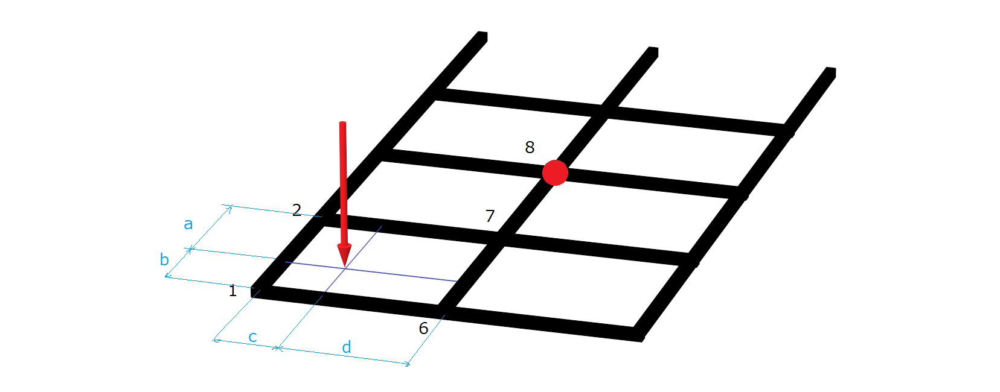
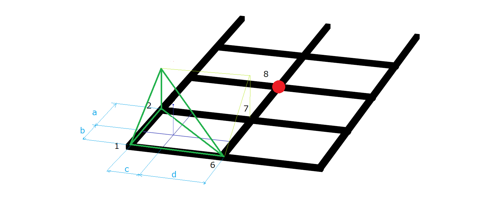

# 影響線載荷計算～面集中荷重～

## 1. 影響線載荷計算とは

### 影響線解析ではない
一般的に**影響線**と言うと下図の影響線を思い浮かべるかもしれませんが今回は違います。

いわゆる**面分布荷重** といわれる荷重で、梁や桁などの構造物に作用する荷重が、面全体に分布している荷重です。

今回は、
## 面集中荷重 について解説します。

## 2. 算出手順
### (1) 面を構成する節点を定義します。

### (2) 求めたい面分布荷重と同じ方向の節点荷重を面を構成する全ての点に載荷します。

1kN の節点荷重を全ての点に載荷します。

### (3) 載荷した荷重に対する解析結果を保存します

### (4) 1-2-6-7面上の集中荷重が載荷した場合を考える

#### 節点8の断面力（曲げモーメント）

| 記号 |   | 節点8の断面力 |
| ---- | ---- | ---- |
| a1 | 1に載荷した場合 | 0.00 |
| a2 | 2に載荷した場合 | 0.35 |
| a6 | 6に載荷した場合 | 0.00 |
| a7 | 7に載荷した場合 | 0.30 |

節点8 の断面力は、関連する節点に載荷した結果から最も遠い 7 の結果を除外した三角形から求める

